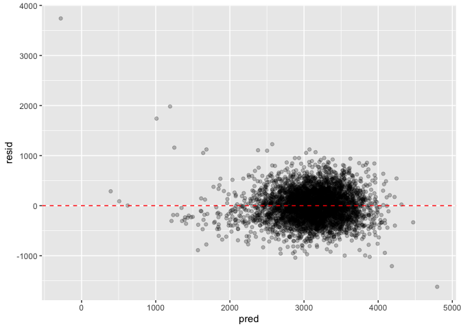

p8105_hw6_enp2116
================
Emily Potts
2022-11-30

# Problem 1

``` r
weather_df = 
  rnoaa::meteo_pull_monitors(
    c("USW00094728"),
    var = c("PRCP", "TMIN", "TMAX"), 
    date_min = "2017-01-01",
    date_max = "2017-12-31") %>%
  mutate(
    name = recode(id, USW00094728 = "CentralPark_NY"),
    tmin = tmin / 10,
    tmax = tmax / 10) %>%
  select(name, id, everything())
```

First, we will get a distribution for $\hat{r^2}$ by drawing 5000
bootstrap samples; adding SLR models (with tmax as the response and tmin
as the predictor) to each sample. Then, we extract the $\hat{r^2}$ value
from the model results and plot the density.

``` r
r_squared_estimates =
  weather_df %>% 
  modelr::bootstrap(n = 5000) %>% 
  mutate(
    lin_models = map(strap, ~lm(tmax ~ tmin, data = .x) ),
    lin_mod_results = map(lin_models, broom::glance)
    ) %>% 
  select(-strap, -lin_models) %>% 
  unnest(lin_mod_results)

r_squared_estimates %>% 
  ggplot(aes(x = r.squared)) + geom_density() + labs(
    title = "Distribution of R Squared",
    x = "R Squared",
    y = "Density")
```

<!-- -->

``` r
quantile(r_squared_estimates$r.squared, na.rm = T,probs = c(0.025, 0.975))
```

    ##      2.5%     97.5% 
    ## 0.8941280 0.9276839

In this plot, we can see that the $\hat{r}^2$ value is high (peak at
around 0.91) and that the distribution has a left-skew (most likely due
to upper bound at 1). The 2.5% and 97.5% quantiles of the estimates
across our bootstrap samples allow to construct a 95% CI for ${r}^2$,
which is (0.894, 0.928). Since our distribution is not symmetric, this
is a better approximation than the standard CI formula (mean +/-
1.96\*SE).

Next, we will get a distribution for $log(\hat{\beta_0 * \beta_1})$ by a
similar process: drawing bootstrap samples; adding SLR models (with tmax
as the response and tmin as the predictor) to each sample and extracting
the $log(\hat{\beta_0 * \beta_1})$ value to plot the density.

``` r
log_beta_product_est =
weather_df %>% 
  modelr::bootstrap(n = 5000) %>% 
  mutate(
    lin_models = map(strap, ~lm(tmax ~ tmin, data = .x) ),
    lin_mod_results = map(lin_models, broom::tidy)) %>% 
  select(-strap, -lin_models) %>% 
  unnest(lin_mod_results) %>% 
  select(id = `.id`, term, estimate) %>% 
  pivot_wider(
    names_from = term, 
    values_from = estimate) %>% 
  rename(beta0 = `(Intercept)`, beta1 = tmin) %>% 
  mutate(log_b0b1 = log(beta0 * beta1)) 

log_beta_product_est %>% 
  ggplot(aes(x = log_b0b1)) + geom_density() + labs(
    title = "Distribution of Log(Beta 0 * Beta 1)",
    x = "Log(Beta 0 * Beta 1)",
    y = "Density")
```

<!-- -->

``` r
quantile(log_beta_product_est$log_b0b1, na.rm = T,probs = c(0.025, 0.975))
```

    ##     2.5%    97.5% 
    ## 1.964571 2.058591

From the plot, we can see that the $log(\hat{\beta_0 * \beta_1})$
distribution is also somewhat skewed but has a peak at around 2.01. The
2.5% and 97.5% quantiles of the estimates across bootstrap samples allow
us to construct a 95% CI for $log(\hat{\beta_0 * \beta_1})$, which is
(1.965, 2.060). Again, since our distribution is not symmetric, this is
a better approximation than the standard CI formula (mean +/- 1.96\*SE).

# Problem 2

Washington Post homicides:

Creating a city_state variable and a binary variable (outcome)
indicating whether the homicide is solved. Omitting cities Dallas, TX;
Phoenix, AZ; Kansas City; and MO Tulsa, AL. Limiting analysis those for
whom victim_race is white or black, and making sure that victim_age is
numeric.

``` r
tidy_homicide = 
  read_csv("data/homicide-data.csv") %>% 
  mutate(
    city_state = paste(city, state, sep = ", "),
    resolved = as.numeric(disposition == "Closed by arrest"),
    victim_age = as.numeric(victim_age)) %>% 
  filter(!city_state %in% c("Dallas, TX", "Phoenix, AZ", "Kansas City, MO", "Tulsa, AL")) %>% 
  filter(victim_race  %in% c( "Black", "White"))
```

For the city of Baltimore, MD, using the glm function to fit a logistic
regression with resolved vs unresolved as the outcome and victim age,
sex and race as predictors. Saving the output of glm as an R object;
applying the broom::tidy to this object; and obtaining the estimate and
confidence interval of the adjusted odds ratio for solving homicides
comparing male victims to female victims keeping all other variables
fixed:

``` r
balt_log_fit = 
  tidy_homicide %>% 
  filter(city_state == "Baltimore, MD") %>% 
  glm(resolved ~ victim_age + victim_race + victim_sex, data = ., family = binomial()) 

balt_log_fit %>% 
  broom::tidy() %>% 
  mutate(OR = exp(estimate),
         est_low_CI = estimate - std.error * qnorm(0.975),
         est_high_CI = estimate + std.error * qnorm(0.975),
         OR_low_CI = exp(est_low_CI),
         OR_high_CI = exp(est_high_CI),
         ) %>% 
  filter(term == "victim_sexMale") %>% 
  select(term, OR, OR_low_CI, OR_high_CI, p.value) %>% 
  knitr::kable(digits = 3)
```

| term           |    OR | OR_low_CI | OR_high_CI | p.value |
|:---------------|------:|----------:|-----------:|--------:|
| victim_sexMale | 0.426 |     0.325 |      0.558 |       0 |

We are 95% confident that the adjusted odds ratio for solving homicides
comparing male victims to female victims keeping victim race and age
fixed is between 0.325 and 0.558. Since the odds ratio is less than one
and its p-value = 0 \< 0.05, this means that when controlling for the
impacts of other victim-related variables, homicides in which the
victims are male are significantly less likely to be resolved that those
in which the victim is female.

Now running glm for each of the cities in my dataset, and extracting the
adjusted odds ratio (and CI) for solving homicides comparing male
victims to female victims:

``` r
city_state_glms =
  tidy_homicide %>% 
  nest(data = -city_state) %>% 
  mutate(
    glms = map(data, ~glm(resolved ~ victim_age + victim_race + victim_sex, data = ., family = binomial())),
    results = map(glms, broom::tidy)) %>% 
  select(-data, -glms) %>% 
  unnest(results) %>% 
  filter(term == "victim_sexMale") %>% 
  mutate(OR = exp(estimate),
         est_low_CI = estimate - std.error * qnorm(0.975),
         est_high_CI = estimate + std.error * qnorm(0.975),
         OR_low_CI = exp(est_low_CI),
         OR_high_CI = exp(est_high_CI),
         ) %>% 
  select(city_state, term, OR, OR_low_CI, OR_high_CI, p.value) 
head(city_state_glms)
```

    ## # A tibble: 6 × 6
    ##   city_state      term              OR OR_low_CI OR_high_CI  p.value
    ##   <chr>           <chr>          <dbl>     <dbl>      <dbl>    <dbl>
    ## 1 Albuquerque, NM victim_sexMale 1.77      0.831      3.76  1.39e- 1
    ## 2 Atlanta, GA     victim_sexMale 1.00      0.684      1.46  1.00e+ 0
    ## 3 Baltimore, MD   victim_sexMale 0.426     0.325      0.558 6.26e-10
    ## 4 Baton Rouge, LA victim_sexMale 0.381     0.209      0.695 1.65e- 3
    ## 5 Birmingham, AL  victim_sexMale 0.870     0.574      1.32  5.11e- 1
    ## 6 Boston, MA      victim_sexMale 0.674     0.356      1.28  2.26e- 1

Create a plot that shows the estimated ORs and CIs for each city.
Organize cities according to estimated OR, and comment on the plot.

``` r
city_state_glms %>% 
  mutate(city_state = forcats::fct_reorder(city_state, OR)) %>% 
  ggplot(aes(x = city_state, y = OR, color = city_state)) + geom_point() + geom_errorbar(aes(ymin = OR_low_CI, ymax = OR_high_CI)) +
  theme(axis.text.x = element_text(angle = 80, hjust = 1, size = 7))  + 
  labs(
    title = "Adjusted Odds Ratios for Male to Female Solved Homicides",
    x = "Location (City, State)",
    y = "Adjusted OR and 95% CI"
    ) +  
  theme(legend.position = "None")
```

<!-- -->
Based on the plot, we can see that the majority of cities have an
adjusted odds ratio less than 1, indicating that when controlling for
the impacts of other victim-related variables, homicides in which the
victims are male are less likely to be resolved that those in which the
victim is female. We do however, see some cities with quite wide 95% CIs
for this odds ratio. This occurs primarily in cities that have the
highest male to female adjusted ORs (the right side of the graph), such
as Albuquerque, NM, Stockton, CA, and Fresno, CA.

# Problem 3

Loading and clean the data for regression analysis (i.e. convert numeric
to factor where appropriate, check for missing data, etc.). There seems
to be no missing data.

``` r
tidy_birthweight =
  read_csv("data/birthweight.csv") %>% 
  janitor::clean_names() %>%
  mutate(
    babysex = as.factor(babysex),
    babysex = fct_recode(babysex, "male" = "1", "female" = "2"),
    frace = as.factor(frace),
    frace = fct_recode(frace, "white" = "1", "black" = "2", "asian" = "3", 
                       "puerto rican" = "4", "other" = "8"),
    malform = as.logical(malform),
    mrace = as.factor(mrace),
    mrace = fct_recode(mrace, "white" = "1", "black" = "2", "asian" = "3", 
                       "puerto rican" = "4"))

tidy_birthweight %>% summarise_all(list(name = ~sum(is.na(.))/length(.)))
```

    ## # A tibble: 1 × 20
    ##   babysex_name bhead_n…¹ bleng…² bwt_n…³ delwt…⁴ finco…⁵ frace…⁶ gawee…⁷ malfo…⁸
    ##          <dbl>     <dbl>   <dbl>   <dbl>   <dbl>   <dbl>   <dbl>   <dbl>   <dbl>
    ## 1            0         0       0       0       0       0       0       0       0
    ## # … with 11 more variables: menarche_name <dbl>, mheight_name <dbl>,
    ## #   momage_name <dbl>, mrace_name <dbl>, parity_name <dbl>, pnumlbw_name <dbl>,
    ## #   pnumsga_name <dbl>, ppbmi_name <dbl>, ppwt_name <dbl>, smoken_name <dbl>,
    ## #   wtgain_name <dbl>, and abbreviated variable names ¹​bhead_name,
    ## #   ²​blength_name, ³​bwt_name, ⁴​delwt_name, ⁵​fincome_name, ⁶​frace_name,
    ## #   ⁷​gaweeks_name, ⁸​malform_name

Propose a regression model for birthweight. This model may be based on a
hypothesized structure for the factors that underly birthweight, on a
data-driven model-building process, or a combination of the two.

``` r
bw_reg_model = 
  tidy_birthweight %>% 
  lm(data = ., bwt ~ blength + delwt + ppwt + gaweeks + fincome + mrace + parity  + smoken) 

summary(bw_reg_model)
```

    ## 
    ## Call:
    ## lm(formula = bwt ~ blength + delwt + ppwt + gaweeks + fincome + 
    ##     mrace + parity + smoken, data = .)
    ## 
    ## Residuals:
    ##     Min      1Q  Median      3Q     Max 
    ## -1620.8  -206.9    -9.3   197.8  3739.8 
    ## 
    ## Coefficients:
    ##                     Estimate Std. Error t value Pr(>|t|)    
    ## (Intercept)       -3899.3653    99.3831 -39.236  < 2e-16 ***
    ## blength             116.2497     1.9638  59.197  < 2e-16 ***
    ## delwt                 5.4269     0.4506  12.044  < 2e-16 ***
    ## ppwt                 -3.0154     0.4874  -6.187 6.71e-10 ***
    ## gaweeks              22.6093     1.6497  13.705  < 2e-16 ***
    ## fincome               0.6355     0.2011   3.160  0.00159 ** 
    ## mraceblack         -172.4070    11.3995 -15.124  < 2e-16 ***
    ## mraceasian          -66.2545    48.8959  -1.355  0.17548    
    ## mracepuerto rican   -87.5183    21.8732  -4.001 6.41e-05 ***
    ## parity              122.5425    46.5992   2.630  0.00858 ** 
    ## smoken               -6.2024     0.6746  -9.194  < 2e-16 ***
    ## ---
    ## Signif. codes:  0 '***' 0.001 '**' 0.01 '*' 0.05 '.' 0.1 ' ' 1
    ## 
    ## Residual standard error: 314.8 on 4331 degrees of freedom
    ## Multiple R-squared:  0.6231, Adjusted R-squared:  0.6222 
    ## F-statistic:   716 on 10 and 4331 DF,  p-value: < 2.2e-16

I built my proposed model using backward elimination, initially starting
with the variables of blength, delwt, gaweeks, fincome , malform,
momage, mrace, parity, ppwt, and smoken. I chose these variables based
on current literature indicating key baby/pregnancy/mother measures
(both innate and situational) that have been linked to a baby’s low
birthweight. I first removed malform, as it had the highest alpha of
0.717. After running the regression again, I removed momage, as it had
the next highest alpha of 0.375. My final model had blength, delwt,
gaweeks, fincome , mrace, parity, ppwt, and smoken as predictors, which
all had statistically significant p-values less than 0.05 (with the
exception of mraceasian compared to mracewhite). The final adjusted
$R^2$ was 0.6222, which did not improve with taking out additional
variables.

Plot of model residuals against fitted values:

``` r
modelr::add_residuals(data = tidy_birthweight, model = bw_reg_model) %>% 
modelr::add_predictions(data = ., model = bw_reg_model) %>% 
  ggplot(aes(x = pred, y = resid)) + geom_point(alpha = 0.25) +
  geom_hline(yintercept=0,linetype="dashed", col="red")
```

<!-- -->
This residual plot seems to show no pattern (which is good), with the
exception of some higher residual values at low predicted values.

Compare model to two other models:

One using length at birth and gestational age as predictors (main
effects only)

``` r
main_effects_mod = 
  tidy_birthweight %>% 
  lm(data = ., bwt ~ blength + gaweeks) 

summary(main_effects_mod)
```

    ## 
    ## Call:
    ## lm(formula = bwt ~ blength + gaweeks, data = .)
    ## 
    ## Residuals:
    ##     Min      1Q  Median      3Q     Max 
    ## -1709.6  -215.4   -11.4   208.2  4188.8 
    ## 
    ## Coefficients:
    ##              Estimate Std. Error t value Pr(>|t|)    
    ## (Intercept) -4347.667     97.958  -44.38   <2e-16 ***
    ## blength       128.556      1.990   64.60   <2e-16 ***
    ## gaweeks        27.047      1.718   15.74   <2e-16 ***
    ## ---
    ## Signif. codes:  0 '***' 0.001 '**' 0.01 '*' 0.05 '.' 0.1 ' ' 1
    ## 
    ## Residual standard error: 333.2 on 4339 degrees of freedom
    ## Multiple R-squared:  0.5769, Adjusted R-squared:  0.5767 
    ## F-statistic:  2958 on 2 and 4339 DF,  p-value: < 2.2e-16

The main effects model has all statistically significant p-values less
than 0.05 , with an adjusted $R^2$ of 0.5767.

One using head circumference, length, sex, and all interactions
(including the three-way interaction) between these

``` r
interaction_mod = 
  tidy_birthweight %>% 
  lm(data = ., bwt ~ bhead*blength*babysex)

summary(interaction_mod)
```

    ## 
    ## Call:
    ## lm(formula = bwt ~ bhead * blength * babysex, data = .)
    ## 
    ## Residuals:
    ##      Min       1Q   Median       3Q      Max 
    ## -1132.99  -190.42   -10.33   178.63  2617.96 
    ## 
    ## Coefficients:
    ##                               Estimate Std. Error t value Pr(>|t|)    
    ## (Intercept)                 -7176.8170  1264.8397  -5.674 1.49e-08 ***
    ## bhead                         181.7956    38.0542   4.777 1.84e-06 ***
    ## blength                       102.1269    26.2118   3.896 9.92e-05 ***
    ## babysexfemale                6374.8684  1677.7669   3.800 0.000147 ***
    ## bhead:blength                  -0.5536     0.7802  -0.710 0.478012    
    ## bhead:babysexfemale          -198.3932    51.0917  -3.883 0.000105 ***
    ## blength:babysexfemale        -123.7729    35.1185  -3.524 0.000429 ***
    ## bhead:blength:babysexfemale     3.8781     1.0566   3.670 0.000245 ***
    ## ---
    ## Signif. codes:  0 '***' 0.001 '**' 0.01 '*' 0.05 '.' 0.1 ' ' 1
    ## 
    ## Residual standard error: 287.7 on 4334 degrees of freedom
    ## Multiple R-squared:  0.6849, Adjusted R-squared:  0.6844 
    ## F-statistic:  1346 on 7 and 4334 DF,  p-value: < 2.2e-16

This interaction model had all statistically significant p-values less
than 0.05 (with the exception of bhead:blength), with an adjusted $R^2$
of 0.6844.

Make this comparison in terms of the cross-validated prediction error;
use crossv_mc and functions in purrr as appropriate.

``` r
cv_df =
  crossv_mc(tidy_birthweight, 100) %>% 
  mutate(
    train = map(train, as_tibble),
    test = map(test, as_tibble))
```

``` r
cv_df = 
  cv_df %>% 
  mutate(
    bw_reg_model  = map(train, ~lm(data = ., bwt ~ blength + delwt + gaweeks + fincome + mrace + parity + ppwt + smoken)),
    main_effects_mod   = map(train, ~lm(data = ., bwt ~ blength + gaweeks)),
    interaction_mod  = map(train, ~lm(data = ., bwt ~ bhead*blength*babysex))) %>% 
  mutate(
    rmse_bw_reg = map2_dbl(bw_reg_model, test, ~rmse(model = .x, data = .y)),
    rmse_main_effects  = map2_dbl(main_effects_mod, test, ~rmse(model = .x, data = .y)),
    rmse_interaction = map2_dbl(interaction_mod, test, ~rmse(model = .x, data = .y)))
```

Violin plot showing the prediction error distribution for each candidate
model:

``` r
cv_df %>% 
  select(starts_with("rmse")) %>% 
  pivot_longer(
    everything(),
    names_to = "model", 
    values_to = "rmse",
    names_prefix = "rmse_") %>% 
  mutate(model = fct_inorder(model)) %>% 
  ggplot(aes(x = model, y = rmse)) + geom_violin()
```

<!-- -->

Based on the violin plot of prediction errors, we can conclude that the
best model is the interaction model, with my proposed model next, and
finally the main effects model. This agrees with the conclusions we
would gather from the adjusted $R^2$.
